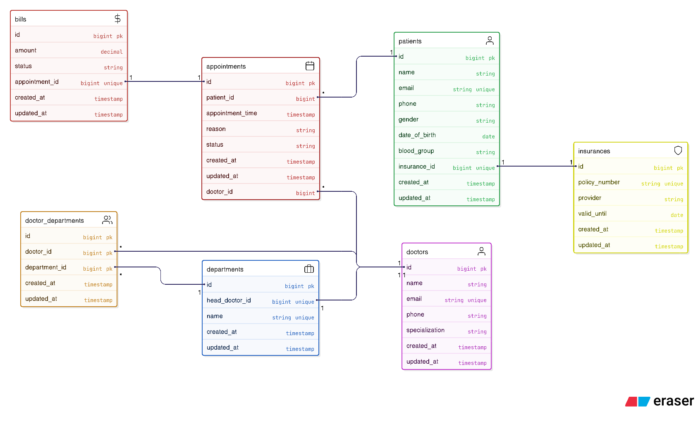

# Entity Relationship Diagram (ERD)

The following diagram represents the database schema and relationships used in the Hospital Management System.

## ER Diagram

## Key Relationships

### Patient → Appointment

One patient can have multiple appointments.

Relationship type:

One-to-Many

---

### Doctor → Appointment

A doctor can have multiple appointments.

Relationship type:

One-to-Many

---

### Doctor ↔ Department

Doctors can belong to multiple departments and departments can have multiple doctors.

Relationship type:

Many-to-Many

---

### Department → Head Doctor

Each department can have one head doctor.

Relationship type:

One-to-One

---

### Appointment → Bill

Each appointment automatically generates a bill.

Relationship type:

One-to-One

---

### Patient → Insurance

A patient can optionally have one insurance policy.

Relationship type:

One-to-One
